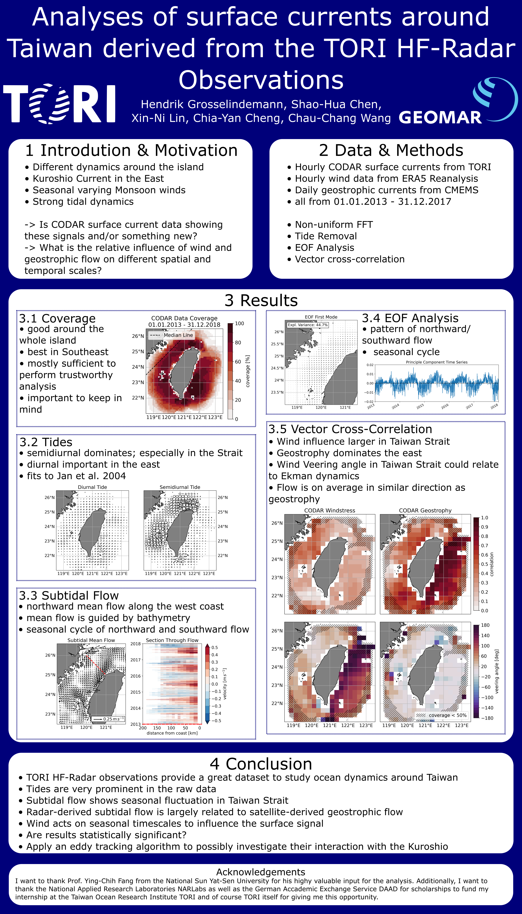

# TORI

Repository for the Taiwan Ocean Radar Observing System analysis using CODAR data performed by Hendrik Grosselindemann during his internship in March and April 2023.
For any questions, feel free to open an issue.

# Data access
- CODAR Data has to be requested from TORI
- ERA5 Reanalysis data has been downloaded [here](https://cds.climate.copernicus.eu/cdsapp#!/dataset/reanalysis-era5-pressure-levels?tab=overview)
- CMEMS Geostrophic velocities have been downloaded [here](https://data.marine.copernicus.eu/product/SEALEVEL_GLO_PHY_L4_MY_008_047/description) 

# Run these codes
You can use my docker container for scientific computing. See description and how to use here https://github.com/hgrosselindemann/docker-jlab
