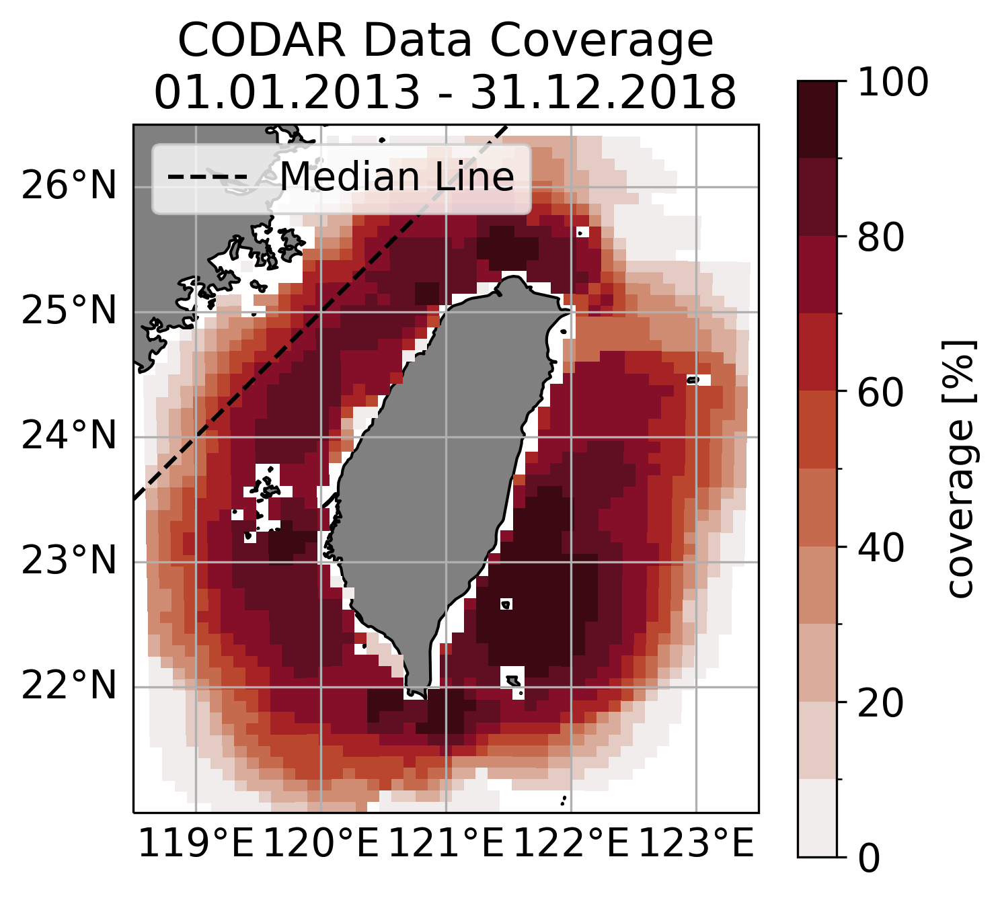

# Data
The main dataset used was surface current data from high-frequency radars set up and maintained by the Taiwan Ocean Research Institute.
The data period goes from 2013/1/1 to 2017/12/31 with hourly measurements on a 10km grid.
Additionally, ERA5 reanalysis wind data and CMEMS satellite derived geostrophic currents where downloaded for the same period.
They are on different 0.25° grids.
Wind data is hourly, while satellite data is daily.

# Methods
A couple different analysing techniques have been applied.

The main one was spectral analysis.
But as the CODAR data is not perfect and has some gaps, especially further away from the antennas, the fourier transformation became difficult.
Usually, spectral analysis has to be done on a uniform temporal grid without missing values.
But I did not want to perform any interpolation, because some gaps are quite large and linear interpolation would be just wrong.
Fitting another interpolation method is questionable as well.
Therefore, I used a technique called non-uniform discrete/fast fourier transformation (NUFFT), in which one gives the algorithm the time steps between each data point, which can vary.
Before performing the NUFFT, the data has been demeaned and detrended.
No window function has been applied, because it would remove amplitude necessary for the later performed reconstruction of the time series from the frequency domain.
Because of handling velocity data, the u and v components where combined in the complex plane as u = u + iv.
This has been used for the NUFFT.

# Results
## Data Coverage

The data coverage for the investigated period is quite good around the whole island.
It is best in the Southeast, while being above 80% is the Taiwan Strait.
Therefore, the data allows reliable analysis.
Of course one has to keep the data coverage in mind before interpreting too much.
All analysis have been performed for each data point regardless of its coverage, so this point is especially important.

As on can see in this example of the powerspectrum from the NUFFT for the u component in the Taiwan Strait, the method works quite nicely.
