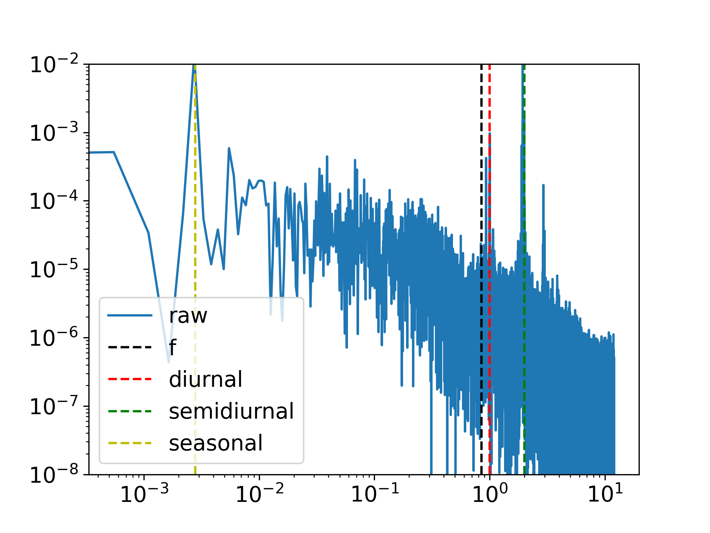
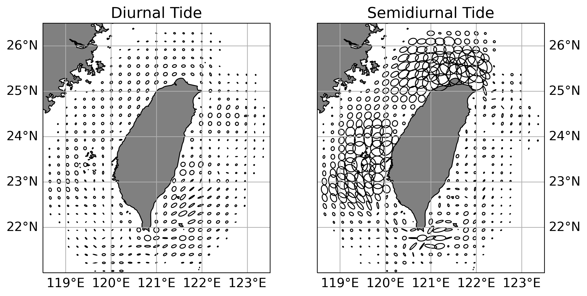
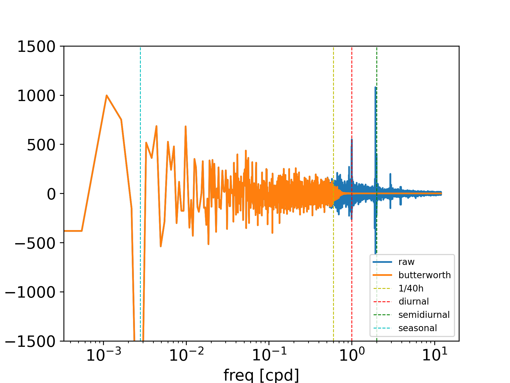
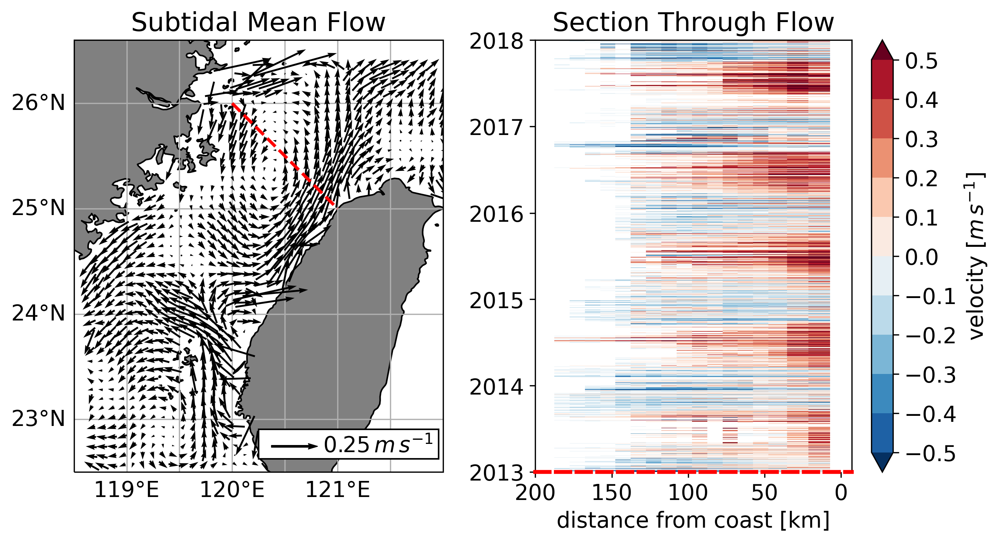
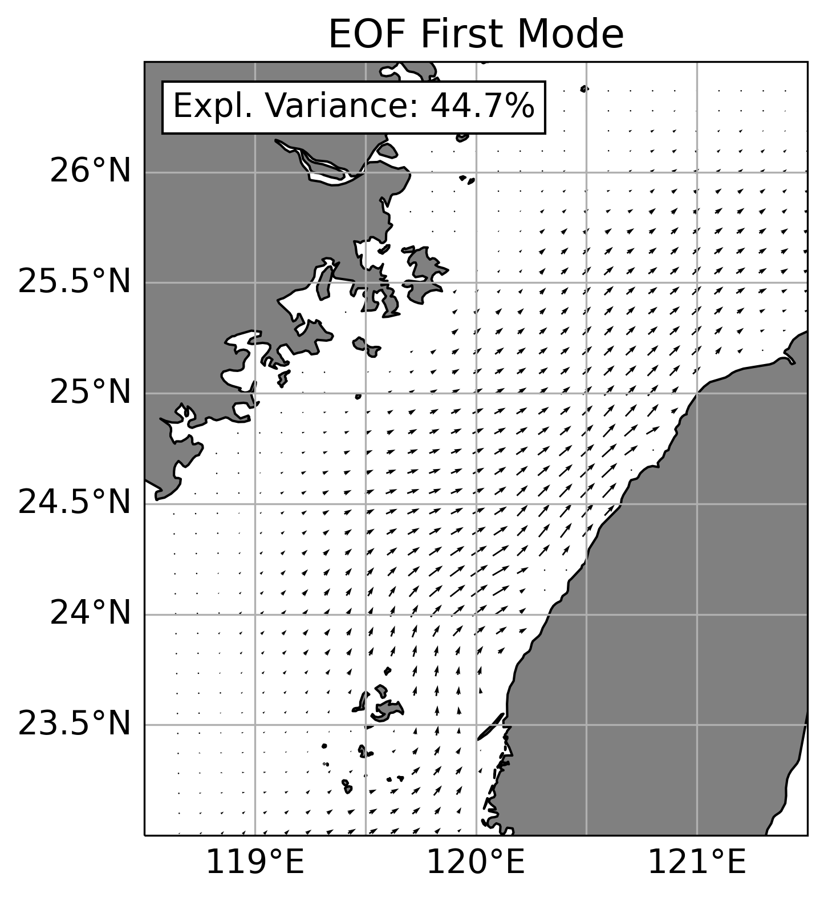

# Data
The main dataset used was surface current data from high-frequency radars set up and maintained by the Taiwan Ocean Research Institute.
The data period goes from 2013/1/1 to 2017/12/31 with hourly measurements on a 10km grid.
Additionally, ERA5 reanalysis wind data and CMEMS satellite derived geostrophic currents where downloaded for the same period.
They are on different 0.25° grids.
Wind data is hourly, while satellite data is daily.

# Methods
A couple different analysing techniques have been applied.

The main one was spectral analysis.
But as the CODAR data is not perfect and has some gaps, especially further away from the antennas, the fourier transformation became difficult.
Usually, spectral analysis has to be done on a uniform temporal grid without missing values.
But I did not want to perform any interpolation, because some gaps are quite large and linear interpolation would be just wrong.
Fitting another interpolation method is questionable as well.
Therefore, I used a technique called non-uniform discrete/fast fourier transformation (NUFFT), in which one gives the algorithm the time steps between each data point, which can vary.
Before performing the NUFFT, the data has been demeaned and detrended.
No window function has been applied, because it would remove amplitude necessary for the later performed reconstruction of the time series from the frequency domain.
Because of handling velocity data, the u and v components where combined in the complex plane as u = u + iv.
This has been used for the NUFFT.

Based on the spectral analysis, a peak finding method has been used to check if there is a peak in a certain frequency range.
If so, the amplitude and frequency of the peak were extracted.
Spectral ellipses have been calculated using these to investigate the spatial difference in importance of certain frequencies.
Ellipse characteristics are based on formulas from [Walden2013](https://doi.org/10.1098/rsta.2011.0554).
The main interest was on the tidal signal, while also considering the coriolis frequency and the seasonal variation.

Time Filtering has been applied to remove the tidal signal from the data.
For this, a Butterworth window with a cut-off frequency of 1/40 cph and order 10 has been applied to the frequency amplitudes.
An inverse NUFFT has been performed on these filtered frequencies to reconstruct the time series.

Three sections have been extracted in the Taiwan Strait to investigate the throughflow and its temporal variability.
Sections were defined based on a start and end latitude and then, the closest points to this section extracted.
This can result in a staircase like structure.
Furthermore, velocity components have been rotated according to the section to end up with an along-section and cross-section velocity.

An EOF analysis has been done for the Taiwan Strait.
Points were this were selected using a mask.
Missing values have been set to zero, otherwise, the algorithm does not work.

For the comparison of surface currents to wind and geostrophic flow, the codar data has been averaged onto the coarser grid of the geostrophic velocities.
As the wind and geostrophic grid had not the same points while having the same resolution, the wind has been regridded as well.

A vector cross-correlation technique has been applied to investigate the relation of radar-derived flow to surface windstress and geostrophic currents.
The method is precisely described in the paper from [Kundu1976](https://doi.org/10.1175/1520-0485(1976)006%3C0238:EVONTO%3E2.0.CO;2).
It basically computes a correlation coeffient as well as the average veering angle between the two vectors over time.
The correlation coefficient is only between 0 to 1 and can not be negative.
This information comes from the veering angle.
The veering angle however can only really be interpreted if the correlation is high. 
Lagged correlation have been done as well, where the surface currents lag the wind or geostrophic velocities.
Confidence levels for this calculation were calculated using a bootstrap approach.
Applied was a mooving bootstrap window of size 24 to resample the data.
Vector cross-correlation has been performed on the resample.
10000 replications of this lead to a distribution of the the correlation and the veering angle.
Upper and lower confidence levels were calculated with a simple percentile method for the 2.5% and 97.5% percentile to end up with a 95% confidence level.

I tried to calculate the significance of the correlation by applying a permutation test.
But random permutations on a time-series is not that valid, because the samples are not independant.
So I did not finish this approach.

Coherence between the surface currents and wind as well as geostrophic flow has been calculated.
This has been done by applying Welch's wethod and the NUFFT to extract cross-spectra.
For codar-wind a window size of 512 has been used.
As the geostrophic flow is only daily, surface currents have been daily averaged.
Then, because of way less data points, the window size has been reduced to 128.

I applied a lagrangian particle tracking method, [oceanparcels](https://oceanparcels.org/).
This works quite nicely, an example can be seen [here](./figures/parcels_penghu_channel.png), but has not been used for the analysis because lack of time and not having a specific approach.
An idea could be to release particles in the Penghu-channel each day and track them for a month or so to end up with a distribution of tracks in the Taiwan Strait.

# Results
## Data Coverage

The data coverage for the investigated period is quite good around the whole island.
It is best in the Southeast, while being above 80% is the Taiwan Strait.
Therefore, the data allows reliable analysis.
All analysis have been performed for each data point regardless of its coverage.
So keeping the data coverage in mind before interpreting too much is especially important.

## Spectral Analysis

As on can see in this example of the powerspectrum from the NUFFT for the u component in the Taiwan Strait, the method works quite nicely.
Strong peaks appear at diurnal and semidiurnal frequencies showing tides.
A seasonal fluctuation is very prominent as well.
An example of a rotary spectrum can be seen [here](./figures/spectrum_example_rotary.png)
# Tides

Tidal ellipses show the importance of tides around the island, but also their regional distribution.
Semidiurnal tides dominate, especially in the Taiwan Strait, but also around the southern most tip of the island.
Diurnal tides are stronger in the eastern part.
The pattern of semidiurnal tides fits to the one found by [Jan2004](https://doi.org/10.1029/2003GL019373) in their modelling study.

## Time Filtering

The applied [Butterworth Window](./figures/butterworth_filter) removes the amplitude of the high-frequency domain including tides.
Using these filtered frequencies to reconstruct the time series leads to a smoother time series, with most of the extreme values gone.

As one can see, the filtered time series is very close to the daily averages.
One downfall could be, that one removes strong wind bursts for example, which act on high frequencies as well.
Performing an harmonic analysis to remove tides only could be another option.
However, doing this with gaps in the data is hard.

## Section in the Taiwan Strait
The three extracted sections can be seen [here](./figures/sections_map.png).

The mean filtered velocities show a northward flow in the entire strait near the coast of Taiwan.
The flow seems to follow the bathymetry in the Penghu channel, that means, turning to the west after crossing the channel.
It then turns to the east again, back to the coast.
Another portion is reflected back to the south and joins the China coastal current (but low coverage there).
When looking at the temporal evolution of the flow at the sections, a clear seasonal fluctuations appears near the coast of Taiwan.
The northward flow is strongest in summer, but turns to being southward in winter.
This pattern look pretty similar for all the sections, see [here](./figures/sections_hovmoeller.png).
However, the importance of the along- or cross-section velocity for the seasonal fluctuation differs per section.
Time series of section means for [along](./figures/sections_mean_timeseries_along) and [cross](./figures/sections_mean_timeseries_cross) velocities show the seasonal pattern as well.

## EOF Analysis

The EOF analysis basically underlines this spatio-temporal pattern.
It explains 45% of total variance, while the next mode only explains 6%.

The principle component time series has a clear seasonal cycle.

## Seasonal ellipses

Seasonal ellipses show the same thing as well.

## Vector cross-correlation

The correlation between surface currents and the wind is strongest in the Taiwan Strait with values up to 0.6.
The max correlation is at a lag of around 2-5 hours, shown [here](./figures/vector_correlations_lag_max.png), saying that the wind needs some time to force the oceans surface.
Correlation values are pretty much the same for the first couple hours.
The veering angle in this region lies around 10 - 40 degrees.
This is in the range of Ekman dynamics for the surface.
A study from [Stacey1986](https://doi.org/10.1126/science.233.4762.470) says that the observational Ekman angle at the surface only is around 5-20 degrees and not the theoretical 45.
This however is not yet completely clear, because it is hard to measure.
In the east of Taiwan, the veering angle is around 180 degrees, saying that the flow and the wind are opposing each other on average.
This makes sense, because the mean wind is southward, while the Kuroshio current is a stable northward flow all year round.
Geostrophic currents show a very strong correlation in the east, showing the dominance of the Kuroshio current.
The vering angle is around zero, which fits.
The geostrophic flow is also important in the southwest and in the Taiwan Strait
Strongest correlation is at no lag. 

## Coherence

Coherence is strong between the filtered surface currents and geostrophic velocities.
The according frequency is pretty much the mean.
Another second peak can be seen in the meridional velocities in the Southeast of Taiwan.

This could be related to mesoscale eddies, but needs further analysis.
Maybe one could apply an eddy tracking on the surface currents.
Winds show no strong coherence at all, which can be seen [here](./figures/coherence_raw_wind.png) .
In generall, one would need to calculate conficence intervalls for the coherence to see, if calculated values can really mean something.

# Discussion
All in all, the analysis revealed some interesting characteristics of the surface flow around Taiwan.
It underlines, how complicated the dynamics are in the region and how many factors influence them.
The importance of the Kuroshio current in the east has been shown, as well as the impact of seasonally changing winds in the Taiwan Strait.
A lot of things are still to be investigated, so please use this as a basis for further analysis.
